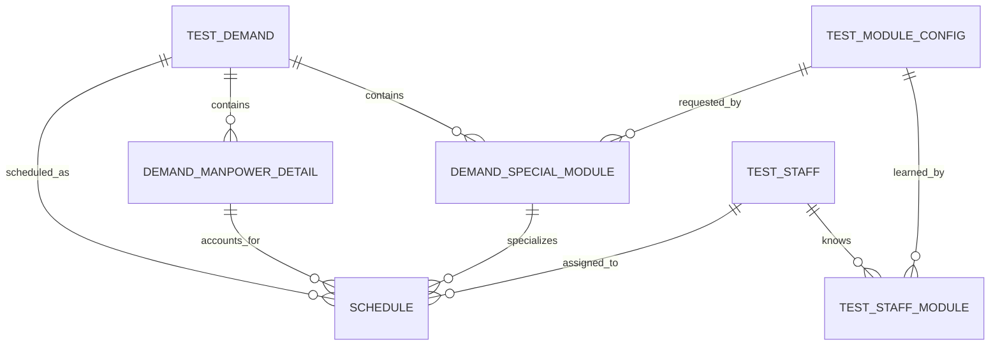

# 特殊模块人力需求与排班硬匹配设计说明

## 1. 文档信息

| 项目 | 内容 |
|------|------|
| 文档主题 | 特殊模块人力需求录入、人员能力维护与排班硬匹配 |
| 适用系统 | 测试排班系统 v1.1 |
| 编写日期 | 2026-07-21 |
| 设计状态 | 已完成业务方案确认，待用户书面审阅 |
| 关联设计 | `docs/superpowers/specs/2026-07-07-schedule-workbench-redesign-design.md` |

## 2. 背景

现有测试需求仅能按测试小组（当前代码字段为 `testType`）填写总人力，并通过 `remark` 自由文本描述“所需模块”。人员的熟悉模块同样保存在自由文本字段中。排班工作台的推荐算法运行在前端，只校验人员状态、测试类型、容量和保密权限，不能可靠判断测试员是否具备某个特殊模块的能力。

实际业务中，一个小组的人力需求通常同时包含：

1. 必须由熟悉指定模块的测试员承担的特殊模块人力。
2. 不要求指定模块能力的通用人力。

如果把某小组的全部人力直接绑定到已选择的特殊模块，会导致该组其他通用测试工作无法排布。因此，本设计将特殊模块人力作为小组总人力的拆分项，而不是新增到总人力之外的独立需求。

## 3. 设计目标

1. 测试经理提交需求时，可按“小组 -> 特殊模块 -> 人力需求”逐行填写多个特殊模块需求。
2. 特殊模块人力计入所属小组总人力，系统自动计算该小组剩余的通用人力。
3. 字段管理员可以维护全系统唯一的特殊模块字典及其所属小组。
4. 人员管理可以结构化维护测试员熟悉的多个特殊模块，且不限制模块必须属于人员所在小组。
5. 自动排班、手动拖拽、修改、转移和发布均执行同一套后端硬校验。
6. 两种自动排班模式均优先满足特殊模块，再分配通用人力，并准确返回不能满足的缺口原因。
7. 历史需求、历史人员和历史排班可兼容迁移，不静默丢失原始信息。

## 4. 非目标

1. 本功能不建设技能等级、熟练度评分、证书有效期或模块经验时长。
2. 本功能不改变现有需求审批角色和审批流。
3. 本功能不要求特殊模块测试员属于模块所属小组；跨组人员允许参与排班。
4. 本功能不自动把历史需求的自由文本备注转换为特殊模块人力，因为历史数据没有可靠的人力拆分数值。
5. 本功能不允许资源主管在排班时临时绕过模块能力限制；能力数据应先在人员管理中维护。
6. 本功能不在前端保留另一套完整推荐算法。

## 5. 术语与口径

| 术语 | 定义 |
|------|------|
| 小组总人力 | 需求中某个测试小组的总人天，沿用 `demand_manpower_detail.manpower_demand` |
| 特殊模块人力 | 某小组总人力中，必须由熟悉指定模块的人员承担的人天 |
| 通用人力 | 小组总人力减去该小组全部特殊模块人力后的剩余人天 |
| 熟悉模块 | 人员具备承担该特殊模块任务的资格；本期仅有“熟悉/不熟悉”两种状态 |
| 草稿排班 | 已写入数据库但 `published=false` 的排班记录 |
| 已发布排班 | `published=true` 的排班记录 |
| 指定日期排班 | 在用户指定日期范围内生成排班草稿，接口模式为 `FIXED_RANGE` |
| 全部需求排班 | 使用各需求自身测试周期生成排班草稿，接口模式为 `FULL_DEMAND` |

本文继续沿用现有代码的 `testType` 字段和“测试类型”配置作为小组标识。前端可按业务用语显示为“小组”，本期不额外引入另一套小组主数据，避免与现有需求人力明细失去对应关系。

所有人力均以“人天”为单位，允许一位小数，最小步长为 `0.1`；所有排班投入仍以百分比记录，`10%` 对应 `0.1` 人天。

## 6. 已确认业务规则

### 6.1 需求人力拆分

对需求 `D` 的某小组 `G`：

```text
通用人力(D, G) = 小组总人力(D, G) - Σ特殊模块人力(D, G, M)
```

必须满足：

```text
小组总人力 > 0
每行特殊模块人力 > 0
Σ特殊模块人力 <= 小组总人力
通用人力 >= 0
```

示例：功能组总人力为 `8.0` 人天，其中支付模块 `2.0` 人天、消息模块 `1.5` 人天，则功能组通用人力为 `4.5` 人天。需求总人力仍为 `8.0` 人天，不是 `11.5` 人天。

### 6.2 特殊模块

1. 模块名称全系统唯一，比较时去除首尾空格；数据库唯一约束作为最终保障。
2. 每个模块必须归属一个小组。
3. 同一需求中，同一个特殊模块只能出现一行。
4. 已被需求或人员引用的模块不可物理删除。
5. 已被引用的模块名称和所属小组不可修改，只允许调整排序或停用。
6. 停用模块不出现在新需求的可选项中，但历史需求仍展示原模块，并允许继续完成既有排班。

### 6.3 人员能力

1. 一名人员可熟悉多个特殊模块。
2. 人员可选择其他小组所属的模块，不受本人 `groupName` 限制。
3. 特殊模块排班必须分配给熟悉该模块的在职测试员。
4. 模块所属小组用于需求人力归类，不用于限制候选人员所属小组。
5. 停用模块不再允许新增到人员能力中；已有关联保留并展示“已停用”标记。

### 6.4 排班优先级

1. 每日先排特殊模块人力，再排通用人力。
2. 特殊模块需求之间按需求风险、需求优先级、截止日期排序；排序相同则按需求创建时间和主键稳定排序。
3. 合格人员按目标周期内剩余容量高、当前负载低排序；排序相同则按人员主键稳定排序。
4. 某特殊模块没有合格人员时，只记录该模块缺口，继续排其他特殊模块和通用人力。
5. 自动排班不得用通用人力结果抵消特殊模块缺口。

### 6.5 发布与完成口径

1. 需求只有在每个小组的特殊模块人力和通用人力全部满足后，才算“人力全部满足”。
2. 工作台的“已分配”标签页使用上述明细口径，不再只按需求总人天判断。
3. 默认只允许发布无冲突且全部人力满足的需求。
4. 发布前必须重新读取数据库并校验模块能力、保密权限、人员状态、日期范围和单日容量，不能信任前端缓存或推荐时快照。

## 7. 前端交互设计

### 7.1 字段配置：特殊模块配置

在“字段配置”增加“特殊模块配置”页签，使用独立表格维护，不混入通用键值型字段行。

列表列项：

| 列 | 说明 |
|----|------|
| 模块名称 | 全系统唯一名称 |
| 所属小组 | 从现有测试类型配置中选择 |
| 状态 | 启用/停用 |
| 排序 | 同一小组下的展示顺序 |
| 引用状态 | 显示是否已被需求或人员引用 |
| 操作 | 编辑、停用/启用、删除 |

交互规则：

1. 新增时填写所属小组、模块名称和排序。
2. 编辑未引用模块时可修改名称、所属小组和排序。
3. 编辑已引用模块时，名称和所属小组只读。
4. 删除前由后端检查引用；存在引用时按钮改为“停用”或提示用户停用。
5. 列表默认按所属小组、排序、模块名称展示。

### 7.2 测试需求提交：特殊模块人力需求

保留现有“按小组填写人力需求”区域，并在其下方增加同级的“特殊模块人力需求”表格。

每行字段：

| 字段 | 控件 | 规则 |
|------|------|------|
| 小组 | 单选下拉框 | 仅显示本需求中总人力大于 `0` 的小组 |
| 特殊模块 | 可搜索单选下拉框 | 先选小组，再加载该小组下启用模块 |
| 人力需求 | 数字输入框 | 大于 `0`，一位小数，步长 `0.1` |
| 删除 | 图标按钮 | 删除当前行 |

交互规则：

1. 点击“新增特殊模块需求”增加空行。
2. 未选择小组时，模块下拉框禁用。
3. 切换小组后清空当前行已选模块和人力，防止模块归属错误。
4. 已被其他行选择的模块在下拉框中禁用，并显示“已添加”。
5. 每个小组人力输入区域实时显示“特殊模块已拆分 / 总人力 / 通用人力”。
6. 特殊模块合计超过该小组总人力时，对小组总人力和相关特殊模块行同时标红，并禁用提交。
7. 将某小组总人力改为 `0` 时，如果已有特殊模块行，不自动删除；提示用户先删除对应行或恢复总人力。
8. 编辑历史需求时，停用模块正常回填并显示“已停用”；不可把新行改选为停用模块。
9. 原 `remark` 保留为只读兼容展示或普通备注，不再承担结构化模块需求。

提交前前端校验用于即时反馈，后端必须再次执行相同约束。需求审批详情和编辑审批页面也必须展示特殊模块明细与每组通用人力，避免审批人只看到总量。

### 7.3 人员管理：熟悉模块

将现有“熟悉模块”自由文本输入改为可搜索多选框：

1. 下拉选项按模块所属小组分组。
2. 默认展示全部启用模块，不按人员所属小组过滤。
3. 已选择项以“所属小组 / 模块名称”显示，避免重名认知错误。
4. 已关联的停用模块仍回填，带“已停用”标记，可移除但不可重新添加。
5. 批量导入人员时，继续兼容“熟悉模块”文本列，按模块全局唯一名称精确解析；未识别模块逐行报错或进入导入结果报告。

### 7.4 人力排布工作台

需求卡片与详情增加以下信息：

1. 每个小组的总人力、特殊模块人力和通用人力。
2. 特殊模块标签及其已分配/待分配人天。
3. 缺口面板按“特殊模块缺口”和“通用人力缺口”分别展示。

人员卡片：

1. 展示结构化熟悉模块标签。
2. 选择某个特殊模块任务时，只突出显示具备该模块能力的人员。
3. 不具备能力的人员保持可见但置为不可分配状态，并在悬停时说明原因。

手动拖拽：

1. 拖动特殊模块任务时，落点必须对应具备该模块能力的人员和有效日期。
2. 前端预校验失败时立即回弹并说明原因。
3. 前端预校验通过后调用后端创建或转移接口；后端失败时回滚视觉状态并展示后端返回原因。
4. 通用任务不要求模块匹配，但仍校验人员状态、保密权限、容量和日期。
5. 需求只有全部明细满足后才移入“已分配”标签页。

两种自动排班入口统一调用后端推荐接口：

1. “按指定日期排班”发送 `mode=FIXED_RANGE` 和用户选择的日期范围。
2. “按全部需求排班”发送 `mode=FULL_DEMAND`，每个需求使用自身开始和结束日期。
3. 推荐结果以草稿形式写入后端，前端负责展示、微调和发布，不再执行完整贪心分配。

## 8. 数据模型

### 8.1 `test_module_config`：特殊模块字典

| 字段 | 类型 | 约束 | 说明 |
|------|------|------|------|
| `id` | BIGINT | PK, auto increment | 模块主键 |
| `module_name` | VARCHAR(100) | NOT NULL, UNIQUE | 全系统唯一模块名称 |
| `test_type` | VARCHAR(100) | NOT NULL | 所属小组，值来自现有测试类型配置 |
| `enabled` | BOOLEAN | NOT NULL, default true | 是否启用 |
| `sort_order` | INT | NOT NULL, default 0 | 展示排序 |
| `created_at` | TIMESTAMP | NOT NULL | 创建时间 |
| `updated_at` | TIMESTAMP | NOT NULL | 更新时间 |

索引：`idx_module_test_type_enabled(test_type, enabled, sort_order)`。

### 8.2 `demand_special_module`：需求特殊模块人力

| 字段 | 类型 | 约束 | 说明 |
|------|------|------|------|
| `id` | BIGINT | PK, auto increment | 明细主键 |
| `demand_id` | BIGINT | NOT NULL, FK | 关联 `test_demand.id` |
| `module_id` | BIGINT | NOT NULL, FK | 关联 `test_module_config.id` |
| `manpower_demand` | DECIMAL(10,1) | NOT NULL | 特殊模块人天 |
| `created_at` | TIMESTAMP | NOT NULL | 创建时间 |
| `updated_at` | TIMESTAMP | NOT NULL | 更新时间 |

约束：

1. 唯一约束 `uk_demand_special_module(demand_id, module_id)`。
2. `manpower_demand > 0` 由数据库检查约束和服务层共同保证。
3. 模块所属小组必须能在同一需求的 `demand_manpower_detail.test_type` 中找到。
4. 同一小组的特殊模块人力之和不得超过该小组总人力。聚合约束由事务内服务层校验。

### 8.3 `test_staff_module`：人员熟悉模块

| 字段 | 类型 | 约束 | 说明 |
|------|------|------|------|
| `staff_id` | BIGINT | PK/FK | 关联 `test_staff.id` |
| `module_id` | BIGINT | PK/FK | 关联 `test_module_config.id` |
| `created_at` | TIMESTAMP | NOT NULL | 关联建立时间 |

复合主键为 `(staff_id, module_id)`，并分别为两个外键建立索引。模块停用不删除既有关联。

### 8.4 `schedule`：排班归属扩展

新增字段：

| 字段 | 类型 | 允许空 | 说明 |
|------|------|--------|------|
| `demand_manpower_detail_id` | BIGINT | 是 | 排班归属的小组人力明细 |
| `demand_special_module_id` | BIGINT | 是 | 排班归属的特殊模块人力明细 |

字段语义：

| 排班类型 | `demand_manpower_detail_id` | `demand_special_module_id` |
|----------|------------------------------|----------------------------|
| 历史通用排班 | 空 | 空 |
| 新通用排班 | 必填 | 空 |
| 新特殊模块排班 | 必填 | 必填 |

特殊模块排班必须同时满足：

1. 两个明细都属于 `schedule.demand_id`。
2. 特殊模块所属小组等于人力明细的 `test_type`。
3. `schedule.staff_id` 对应人员存在 `test_staff_module` 关联。

由于这些约束跨多表，数据库使用外键保证引用存在，服务层在同一事务中保证业务一致性。

### 8.5 数据关系



### 8.6 删除策略

1. 删除未进入审批且没有排班的需求时，级联删除其特殊模块明细和小组人力明细。
2. 已有排班的需求沿用业务关闭，不做物理删除。
3. 删除人员前先处理其排班；模块能力关联可级联删除。
4. 模块仅在完全未引用时允许物理删除，否则只能停用。
5. 排班关联字段使用受限删除，不允许删除仍被排班引用的需求明细。

## 9. 后端领域边界

建议按职责拆分，避免继续把算法和校验堆入现有 `ScheduleService`：

| 组件 | 职责 |
|------|------|
| `TestModuleService` | 模块字典 CRUD、唯一性、引用检查、停用规则 |
| `DemandSpecialModuleService` | 需求特殊模块明细保存、聚合校验、通用人力计算 |
| `StaffModuleService` | 人员与模块关系维护、历史文本迁移 |
| `ScheduleEligibilityService` | 单条排班的人员资格、模块、保密、状态、日期和容量校验 |
| `ScheduleRecommendationService` | 两种模式的后端推荐排班和缺口计算 |
| `SchedulePublishService` | 发布前重校验、批量发布和逐需求结果汇总 |

控制器只负责请求映射和响应，不在控制器或前端复制领域规则。

## 10. API 设计

所有接口沿用当前响应包裹：

```json
{
  "code": 200,
  "message": "success",
  "data": {}
}
```

业务校验失败时，HTTP 状态码与现有全局异常策略保持一致，响应中的 `code` 为非 `200`，稳定业务错误码放在 `data.errorCode`：

```json
{
  "code": 400,
  "message": "张三不熟悉支付模块，无法分配",
  "data": {
    "errorCode": "STAFF_MODULE_NOT_FAMILIAR"
  }
}
```

### 10.1 特殊模块配置

#### 查询模块

```http
GET /api/test-modules?testType=功能组&enabled=true
```

响应 `data`：

```json
[
  {
    "id": 11,
    "moduleName": "支付模块",
    "testType": "功能组",
    "enabled": true,
    "sortOrder": 10,
    "referenced": true
  }
]
```

`testType` 和 `enabled` 均为可选查询条件。

#### 新增模块

```http
POST /api/test-modules
```

```json
{
  "moduleName": "支付模块",
  "testType": "功能组",
  "sortOrder": 10
}
```

#### 修改模块

```http
PUT /api/test-modules/{id}
```

请求字段同新增。已引用时拒绝修改 `moduleName` 或 `testType`。

#### 启停模块

```http
PUT /api/test-modules/{id}/status
```

```json
{ "enabled": false }
```

#### 删除模块

```http
DELETE /api/test-modules/{id}
```

仅未被任何需求或人员引用时成功。

### 10.2 需求创建与更新

现有 `POST /api/demands`、`PUT /api/demands/{id}` 和审批修改接口增加 `specialModuleDemands`。

请求示例：

```json
{
  "product": "示例产品",
  "version": "v2.0.0",
  "startDate": "2026-07-22T00:00:00",
  "endDate": "2026-07-31T00:00:00",
  "versionType": "功能版本",
  "manpowerDetails": [
    {
      "testType": "功能组",
      "manpowerDemand": 8.0,
      "remark": "历史备注继续保留"
    }
  ],
  "specialModuleDemands": [
    {
      "moduleId": 11,
      "manpowerDemand": 2.0
    },
    {
      "moduleId": 12,
      "manpowerDemand": 1.5
    }
  ]
}
```

响应中的特殊模块使用结构化对象：

```json
{
  "id": 501,
  "moduleId": 11,
  "moduleName": "支付模块",
  "testType": "功能组",
  "enabled": true,
  "manpowerDemand": 2.0,
  "allocatedManpower": 0.0,
  "remainingManpower": 2.0
}
```

需求详情额外返回 `manpowerSummary`，供审批页和工作台统一展示：

```json
[
  {
    "testType": "功能组",
    "totalManpower": 8.0,
    "specialManpower": 3.5,
    "generalManpower": 4.5
  }
]
```

创建和更新必须在单个数据库事务中保存需求、小组人力和特殊模块人力；任一校验失败时全部回滚。

### 10.3 人员创建与更新

现有人员接口将字符串 `familiarModules` 替换为 `familiarModuleIds`：

```json
{
  "name": "张三",
  "empNo": "T1001",
  "groupName": "自动化组",
  "familiarModuleIds": [11, 12],
  "confidentialClearance": true
}
```

人员响应返回：

```json
{
  "id": 101,
  "name": "张三",
  "empNo": "T1001",
  "familiarModules": [
    {
      "id": 11,
      "moduleName": "支付模块",
      "testType": "功能组",
      "enabled": true
    }
  ]
}
```

更新人员时 `familiarModuleIds` 采用全量替换语义；缺少该字段表示不修改，传空数组表示清空。

### 10.4 推荐排班

统一接口：

```http
POST /api/schedules/recommend/draft
```

请求示例：

```json
{
  "mode": "FIXED_RANGE",
  "demandIds": [1001, 1002],
  "dateRange": {
    "startDate": "2026-07-22",
    "endDate": "2026-07-28"
  },
  "fixedStaffIds": [101],
  "excludedStaffIds": [109],
  "includeSaturdays": false,
  "includeSundays": false,
  "replaceExistingDrafts": false
}
```

规则：

1. `FIXED_RANGE` 必须传 `dateRange`，实际排班日期还必须落在各需求测试周期内。
2. `FULL_DEMAND` 不传 `dateRange`，逐个使用需求自身周期。
3. `fixedStaffIds` 仅提高合格人员优先级，不能绕过特殊模块、保密、状态或容量限制。
4. `excludedStaffIds` 在两种模式下均完全排除。
5. `replaceExistingDrafts=false` 时保留已有草稿并计算剩余量；为 `true` 时只替换请求中需求的未发布草稿，已发布排班不受影响。
6. 接口在一个排班批次事务中生成草稿；预期业务缺口不视为异常，仍返回已生成部分。

响应示例：

```json
{
  "batchId": "SCH-20260721-0001",
  "generatedSchedules": [
    {
      "id": 9001,
      "demandId": 1001,
      "staffId": 101,
      "date": "2026-07-22",
      "percentage": 50,
      "demandManpowerDetailId": 301,
      "demandSpecialModuleId": 501,
      "published": false
    }
  ],
  "fulfillment": [
    {
      "demandId": 1001,
      "fullySatisfied": false,
      "specialModuleGaps": [
        {
          "demandSpecialModuleId": 502,
          "moduleId": 12,
          "moduleName": "消息模块",
          "testType": "功能组",
          "required": 1.5,
          "allocated": 0.5,
          "shortage": 1.0,
          "reasonCode": "NO_QUALIFIED_STAFF",
          "reason": "没有熟悉消息模块且在周期内有容量的人员"
        }
      ],
      "generalGaps": []
    }
  ],
  "warnings": []
}
```

### 10.5 手动排班创建、修改与转移

单条和批量创建沿用现有接口，但请求必须携带归属明细：

```json
{
  "demandId": 1001,
  "staffId": 101,
  "date": "2026-07-22",
  "percentage": 50,
  "demandManpowerDetailId": 301,
  "demandSpecialModuleId": 501
}
```

现有 `PUT /api/schedules/{id}` 需允许修改 `staffId`、`date`、`percentage` 和两个归属字段，并执行完整校验。建议增加显式转移接口，供拖拽统一调用：

```http
POST /api/schedules/{id}/move
```

```json
{
  "staffId": 108,
  "date": "2026-07-23",
  "percentage": 50
}
```

移动特殊模块排班时不改变其需求归属，只重新校验目标人员是否熟悉对应模块。

### 10.6 校验接口

为拖拽交互提供不落库预校验：

```http
POST /api/schedules/validate
```

请求与单条创建一致。成功返回 `valid=true`；失败返回明确规则和建议。最终创建、修改和发布仍必须重新校验，不能以预校验结果替代事务内校验。

### 10.7 发布接口

单需求发布沿用：

```http
PUT /api/schedules/publish/{demandId}
```

批量发布：

```http
POST /api/schedules/batch-publish
```

```json
{ "demandIds": [1001, 1002, 1003] }
```

批量发布按需求独立事务处理并汇总结果，一个需求失败不回滚其他需求：

```json
{
  "success": [
    { "demandId": 1001, "scheduleCount": 12 }
  ],
  "failed": [
    {
      "demandId": 1002,
      "reasonCode": "SPECIAL_MODULE_UNFULFILLED",
      "reason": "支付模块仍缺少 0.5 人天"
    }
  ]
}
```

## 11. 排班算法

### 11.1 输入快照

推荐开始时一次性读取并锁定本批计算所需的数据版本：

1. 需求及其小组、特殊模块人力明细。
2. 已发布排班和保留的现有草稿。
3. 在职人员、人员系数、每日状态、保密权限和熟悉模块。
4. 模块状态与所属小组。
5. 周末配置、固定人员和排除人员。

推荐结果写入前再次检查相关记录是否被并发修改；若已变化，整批返回 `DATA_CHANGED_RETRY`，不写入部分结果。

### 11.2 计算剩余需求

对每条特殊模块明细：

```text
特殊模块剩余人力 = 特殊模块需求人力 - 对应特殊模块排班已分配人天
```

对每条小组明细：

```text
通用需求人力 = 小组总人力 - 该小组特殊模块需求合计
通用剩余人力 = 通用需求人力 - 该小组通用排班已分配人天
```

已发布排班和保留草稿均计入已分配。历史两个归属字段均为空的排班只计入需求总已分配量，不凭文本猜测特殊模块或小组归属。没有补录特殊模块的历史需求继续使用需求总量口径；一旦补录结构化特殊模块，必须先由资源主管把历史排班归类到小组明细，才能按新明细口径发布。

### 11.3 特殊模块分配

1. 按需求风险、优先级、截止日期、创建时间排序需求。
2. 对需求内每个特殊模块按模块人力缺口从高到低排序。
3. 候选人员必须同时满足：在职、非排除、具备模块关联、具备保密权限（如需要）、日期有效且有剩余容量。
4. 固定人员若合格则优先；不合格时记录警告并跳过。
5. 合格人员按周期剩余容量高、负载低、人员主键排序。
6. 按日期顺序和 `10%` 最小粒度分配，直至模块满足或没有合格容量。
7. 写入两个归属字段，保证该人天同时计入所属小组和特殊模块。

### 11.4 通用人力分配

1. 所有特殊模块尝试完成后，再处理各小组通用人力。
2. 通用人力不校验模块熟悉关系。
3. 继续校验人员状态、排除名单、保密权限、日期和容量。
4. 候选人员排序与特殊模块一致。
5. 只写 `demand_manpower_detail_id`，模块明细字段为空。

### 11.5 容量与并发

1. 单人单日全部已发布排班、草稿排班和本次新生成排班的百分比之和不得超过当日可用容量。
2. 当日可用容量由人员系数与每日状态共同计算，沿用现有系统口径。
3. 批量推荐写入时使用事务和乐观锁版本号；并发冲突时要求用户刷新重试。
4. 同一需求同一时间只允许一个推荐批次写入，防止重复生成草稿。

## 12. 后端硬校验

以下入口必须统一调用 `ScheduleEligibilityService`：单条创建、批量创建、修改、拖拽转移、推荐草稿落库、单需求发布、批量发布。

校验顺序：

1. 需求、人员、排班归属明细存在。
2. 人员处于可排班状态。
3. 日期处于允许范围，且符合周末配置。
4. 排班归属明细属于当前需求。
5. 特殊模块所属小组与人力明细小组一致。
6. 特殊模块排班的人员熟悉该模块。
7. 保密需求的人员具备保密权限。
8. 百分比为 `10` 的整数倍且大于 `0`。
9. 单人单日总负载不超过有效容量。
10. 分配后不超过对应特殊模块或通用人力剩余量。

建议使用稳定错误码：

| 错误码 | 含义 |
|--------|------|
| `MODULE_DISABLED_FOR_NEW_DEMAND` | 新需求选择了停用模块 |
| `MODULE_GROUP_MISMATCH` | 模块所属小组与人力明细不一致 |
| `SPECIAL_MODULE_EXCEEDS_GROUP` | 特殊模块合计超过小组总人力 |
| `STAFF_MODULE_NOT_FAMILIAR` | 人员不熟悉指定模块 |
| `STAFF_CONFIDENTIAL_DENIED` | 人员无保密权限 |
| `STAFF_CAPACITY_EXCEEDED` | 人员当日容量不足 |
| `SCHEDULE_DETAIL_OVER_ALLOCATED` | 明细人力被超额分配 |
| `SPECIAL_MODULE_UNFULFILLED` | 发布时特殊模块仍有缺口 |
| `GENERAL_MANPOWER_UNFULFILLED` | 发布时通用人力仍有缺口 |
| `DATA_CHANGED_RETRY` | 推荐期间数据发生并发变化 |

## 13. 迁移与兼容

### 13.1 迁移机制

1. 引入 Flyway 版本化迁移，H2 和 MySQL 使用同一套兼容 SQL；确有方言差异时按数据库拆分迁移目录。
2. 开发和测试环境迁移稳定后，将 `spring.jpa.hibernate.ddl-auto` 从 `update` 改为 `validate`。
3. 上线迁移前备份 H2 文件数据库或 MySQL 数据库。
4. 迁移顺序：建模块表 -> 建人员模块关系 -> 建需求模块明细 -> 扩展排班表 -> 迁移人员文本 -> 开启新接口。

### 13.2 历史人员熟悉模块

当前能力文本保存在 `users.familiar_modules`：

1. 按英文逗号、中文逗号、英文分号和中文分号拆分。
2. 去除首尾空格和空项。
3. 使用模块全局唯一名称精确匹配，不做模糊匹配。
4. 通过 `users.username = test_staff.emp_no` 找到 `staff_id` 后写入关系表。
5. 未匹配文本、找不到人员账号、重复项写入迁移报告。
6. 原字符串字段暂保留一个版本周期用于审计，确认迁移后再删除。

### 13.3 历史需求

1. `demand_manpower_detail.remark` 原样保留并继续展示。
2. 不从备注自动生成 `demand_special_module`，避免把模块名称误当作有明确人力数值的需求。
3. 历史需求默认没有特殊模块硬约束；编辑并重新提交时，测试经理可主动补录结构化明细。

### 13.4 历史排班

1. 新增两个排班归属字段均允许为空。
2. 对没有结构化特殊模块的历史需求，两个字段均为空的记录视为需求级历史通用排班，可正常查看和发布。
3. 历史记录参与需求总人天统计，但不自动抵扣任何小组明细或特殊模块人力。
4. 当历史需求被补录特殊模块后，已有历史排班仍不自动改归属；界面要求资源主管手工归类到小组明细，或删除未发布历史草稿后重新生成。归类完成前，该需求不可按新明细口径发布。
5. 新建或修改后的排班不允许继续使用双空归属字段。

### 13.5 API 兼容窗口

1. 后端响应在一个版本周期内可同时返回旧 `familiarModules` 字符串和新结构化模块数组，前端只消费新字段。
2. 人员写接口在兼容期可接收旧字符串，但仅用于迁移工具和旧客户端；新页面必须提交 `familiarModuleIds`。
3. 兼容期结束后删除前端贪心推荐逻辑和旧字符串写入口。

## 14. 异常与空状态

| 场景 | 前端表现 | 后端行为 |
|------|----------|----------|
| 小组没有配置模块 | 模块下拉显示空状态并引导联系字段管理员 | 返回空列表 |
| 模块名称重复 | 字段旁提示“模块名称已存在” | 唯一约束冲突转业务错误 |
| 特殊模块合计超总人力 | 标红相关行并禁用提交 | 拒绝整个需求事务 |
| 没有熟悉模块的可用人员 | 推荐结果展示模块级缺口 | 其他模块和通用人力继续排班 |
| 拖给不熟悉模块的人员 | 卡片回弹并提示原因 | 拒绝创建或转移 |
| 推荐后能力被移除 | 草稿显示失效标记 | 发布前重校验并拒绝该需求 |
| 模块已停用 | 历史记录正常展示“已停用” | 禁止新需求引用，允许历史需求完成 |
| 推荐期间数据变化 | 保留当前页面选择并提示刷新重试 | 不写入部分草稿 |
| 批量发布部分失败 | 显示成功数及逐需求失败原因 | 每个需求独立事务，返回明细 |

## 15. 权限与审计

1. 特殊模块配置沿用字段管理员权限。
2. 熟悉模块由现有具备人员管理权限的角色维护。
3. 测试经理在需求提交和被退回编辑阶段维护特殊模块人力。
4. 资源主管和项目经理按现有权限执行排班与发布。
5. 模块启停、人员能力变更、需求特殊模块变更和排班发布均记录操作者、时间、变更前后值。
6. 发布失败日志应包含需求、排班、人员、模块和错误码，但不把堆栈信息直接返回前端。

## 16. 测试范围

### 16.1 单元测试

1. 各小组特殊模块合计及通用人力计算。
2. 模块名称唯一、模块归属和停用规则。
3. 人员跨组模块能力的保存与读取。
4. 特殊模块人员资格校验。
5. 特殊模块优先、通用人力后置的算法顺序。
6. 模块无合格人员时继续处理其他配额。
7. 明细满足状态与“已分配”分类。
8. 发布前能力、保密和容量重校验。

### 16.2 服务集成测试

1. 创建和更新需求时父子人力事务一致性。
2. 单条、批量、修改、转移接口均不能绕过模块硬匹配。
3. `FIXED_RANGE` 和 `FULL_DEMAND` 两种推荐模式。
4. 已有草稿保留与替换语义。
5. 并发推荐和并发拖拽的容量保护。
6. 批量发布部分成功、部分失败。
7. H2 和 MySQL 上的 Flyway 迁移及约束一致性。

### 16.3 前端组件测试

1. 小组与模块下拉联动。
2. 重复模块禁选。
3. 小组总人力变更后的实时汇总和阻断。
4. 停用模块历史回填。
5. 人员跨组模块多选。
6. 不合格拖拽回弹及后端失败回滚。
7. 缺口按特殊模块和通用人力拆分展示。
8. 只有全部明细满足时需求进入“已分配”。

### 16.4 端到端场景

1. 字段管理员创建模块，人员管理员为跨组人员配置该模块，测试经理提交需求，审批后资源主管成功推荐并发布。
2. 特殊模块无人熟悉时产生模块级缺口，其他通用人力仍成功生成草稿。
3. 拖动特殊模块任务给不熟悉人员时无法落位。
4. 推荐后移除人员模块能力，发布时被拦截并给出准确原因。
5. 一个批次中一个需求模块缺口、另一个需求完全满足时，批量发布只发布后者。
6. 历史人员文本迁移包含成功、未匹配、重复和无人员账号四类报告。

## 17. 验收标准

1. 测试经理可在需求表单新增多行“小组、特殊模块、人力需求”，且同模块不可重复。
2. 模块下拉只显示所选小组的启用模块。
3. 每组特殊模块合计超过总人力时，前后端均拒绝提交。
4. 系统展示的需求总人力不因特殊模块拆分而增加。
5. 字段管理员可新增、排序、停用模块；已引用模块不能改名、改组或删除。
6. 人员可跨所属小组选择多个熟悉模块。
7. 两种自动排班均优先排特殊模块，并且不会把特殊模块任务分配给不熟悉人员。
8. 手动创建、拖拽、编辑和转移均不能绕过特殊模块硬匹配。
9. 某模块无合格人员时，该模块显示准确缺口，其他配额继续排班。
10. 需求仅在全部特殊模块与通用人力满足后进入“已分配”。
11. 发布前能力关系发生变化时，后端能够阻止错误发布。
12. 批量发布返回逐需求成功和失败明细，不再只显示无法定位原因的汇总数字。
13. 历史需求、人员和排班可正常读取，未匹配迁移数据有可审计报告。
14. H2 开发环境和 MySQL 目标环境通过同一组核心集成测试。

## 18. 分阶段上线

### 阶段一：数据基础与兼容

1. 引入 Flyway，建立模块、需求模块和人员模块关系表。
2. 扩展排班归属字段。
3. 迁移人员熟悉模块文本并生成报告。
4. 保持现有页面可运行，不启用新排班规则。

### 阶段二：配置与需求录入

1. 上线特殊模块配置页签。
2. 上线人员熟悉模块多选。
3. 上线需求特殊模块人力表单及审批展示。
4. 新需求开始写入结构化模块数据。

### 阶段三：后端排班规则

1. 上线统一资格校验服务。
2. 上线推荐草稿接口和模块/通用缺口计算。
3. 接入手动排班、修改、转移和发布硬校验。
4. 对比新旧推荐结果并完成业务验收。

### 阶段四：工作台切换与清理

1. 两种自动排班入口切换到后端推荐接口。
2. 工作台展示模块级任务、缺口和满足状态。
3. 删除前端旧贪心推荐逻辑和旧自由文本写入口。
4. 兼容期结束后清理旧人员模块字符串字段。

## 19. 实施边界与依赖

本设计可以形成一个完整实施计划，但应按上述四个阶段拆成可独立验证的任务。核心依赖为：

1. 现有测试类型配置值必须稳定，因为它同时作为小组人力和模块所属小组的关联键。
2. 排班工作台必须使用排班归属明细计算满足状态，不能继续只比较需求总人天。
3. 后端推荐与资格校验完成后，前端旧算法必须移除，避免规则漂移。
4. 从 H2 切换 MySQL 前，必须先完成版本化迁移和双数据库集成测试。
